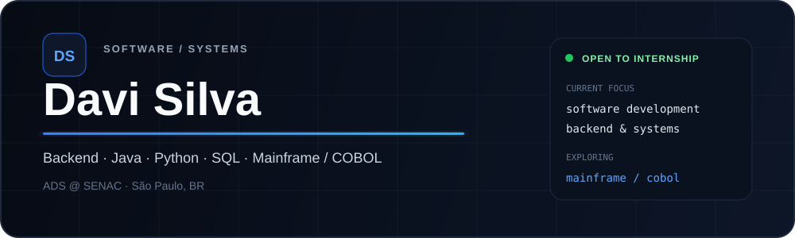

  

  
  

<table>
<tr>
<td width="50%" valign="top">

### Current stack

  

**Building:** backend systems, automation and real business workflows  
**Exploring:** Mainframe, COBOL and enterprise systems  
**Goal:** software development internship

</td>
<td width="50%" valign="top">

### Featured build

**Sales Hub**  
Business-oriented system built from a real operational workflow.

- order and commercial flow
- business rules
- validation and data handling
- billing workflow
- maintainable application structure

</td>
</tr>
</table>

## Live GitHub metrics

  
  

> These panels are generated automatically from my GitHub activity and refresh through GitHub Actions.

## Direction

`Java` · `Python` · `SQL` · `Backend` · `REST APIs` · `Systems` · `Mainframe / COBOL`

Looking primarily for **Software Development, Backend, Systems, Java/Python and Mainframe/COBOL internship opportunities**. Also open to software testing roles.
